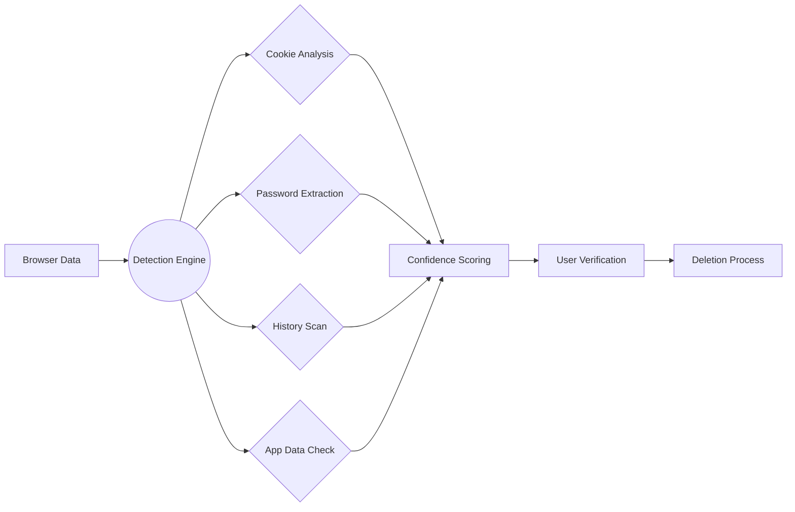

# <div align="center">🛡️ DigitalDetox</div>
<div align="center"><sub>Your Path to True Offline Presence | Reclaim Digital Well-being</sub></div>

<div align="center" style="margin: 1rem 0">
  
  
  
  
  
</div>

---

## 🌟 Why DigitalDetox?

**Problem**: Social media accounts linger even after you stop using them, exposing your data. Manually finding all deletion pages is time-consuming.

**Solution**: DigitalDetox automatically:
1. 🔍 Finds your active accounts across 20+ platforms
2. 💾 Helps you download your data (photos, posts, etc.)
3. 🗑️ Guides you through permanent deletion


---

## 🔧 How It Works

### 1. Smart Detection
Scans four data sources to find accounts:

| Source         | What It Reveals | Accuracy |
|----------------|-----------------|----------|
| Browser Cookies | Logged-in sessions | ★★★★☆ |
| Saved Passwords | Account credentials | ★★★★☆ |
| Browsing History | Recent activity | ★★☆☆☆ |
| Local App Data | Installed clients | ★★★☆☆ |

### 2. Verification & Action
- ✅ **You confirm** which accounts to process
- ⚠️ Dry Run Mode (`--dry-run`) lets you preview findings without making changes
- 🛡️ All processing happens **locally** on your machine

---

## 🚀 Getting Started

### Installation
```bash
git clone https://github.com/Sahil-Harchandani/DigitalDetox.git
cd DigitalDetox
pip install -r requirements.txt
```

**Requirements**:  
- Google Chrome + [ChromeDriver](https://chromedriver.chromium.org/) (for automated steps)
- Administrator access (for full detection capabilities)

---

## 🛠️ Usage Options

### Standard Mode
```bash
python DigitalDetox.py
```
**What happens**:
1. Scans your browsers (Chrome/Firefox/Edge)
2. Shows detected accounts with confidence levels
3. Guides you through data download & deletion

### Dry Run Mode
```bash
python DigitalDetox.py --dry-run
```
**Ideal for**:
- Checking what accounts would be detected
- Understanding the tool before making changes
- Testing without affecting any real accounts

### Debug Mode
```bash
python DigitalDetox.py --debug
```
**Shows**:
- Technical details of the detection process
- Useful for troubleshooting or development

---

## 🌐 Supported Platforms

**Social Networks**  
`Facebook` `Twitter/X` `Instagram` `LinkedIn` `Threads` `Mastodon`

**Media Sharing**  
`YouTube` `TikTok` `Twitch` `Pinterest` `Tumblr`

**Messaging**  
`WhatsApp` `Telegram` `Discord` `WeChat` `Snapchat`

**Communities**  
`Reddit` `Clubhouse` `BeReal` `GitHub` `Medium`

<details>
<summary>🔄 Platform-Specific Notes</summary>

- **Facebook**: 30-day deletion reversal period
- **Twitter**: Requires recent login for deletion
- **WhatsApp**: Deletes messages for everyone
- **YouTube**: Affects Google account-wide
</details>

---

## 🔒 Privacy & Security

**Your data stays private**:
- 🔐 No internet connection needed after installation
- 🗑️ Credentials are discarded after use
- 📁 All processing happens on your device

**Transparency**:
- Open-source code for verification
- Clear logging of all actions

---
## 🔧 Technical Overview



---
## 📜 License & Compliance

**GNU GPLv3** - [Full License Text](LICENSE)

Key Provisions:  
- 🆓 Free redistribution & modification  
- 📝 Source code availability  
- ⚠️ No warranty provided  

---
❓ FAQ
<details> <summary>Does this violate platform Terms of Service?</summary>
DigitalDetox maintains human verification steps to comply with most platform policies when used responsibly.

</details><details> <summary>How are my credentials handled?</summary>
Credentials are stored only in memory during the active session and are cleared immediately after processing each platform.

</details><details> <summary>What if automated login fails?</summary>
The tool will guide you to complete the process manually in the browser window.

</details>

---

<div align="center" style="margin-top: 2rem">
  <strong>Developed with ❤️ by Nebulous</strong><br>
  [](https://github.com/Sahil-Harchandani/DigitalDetox)
</div>
